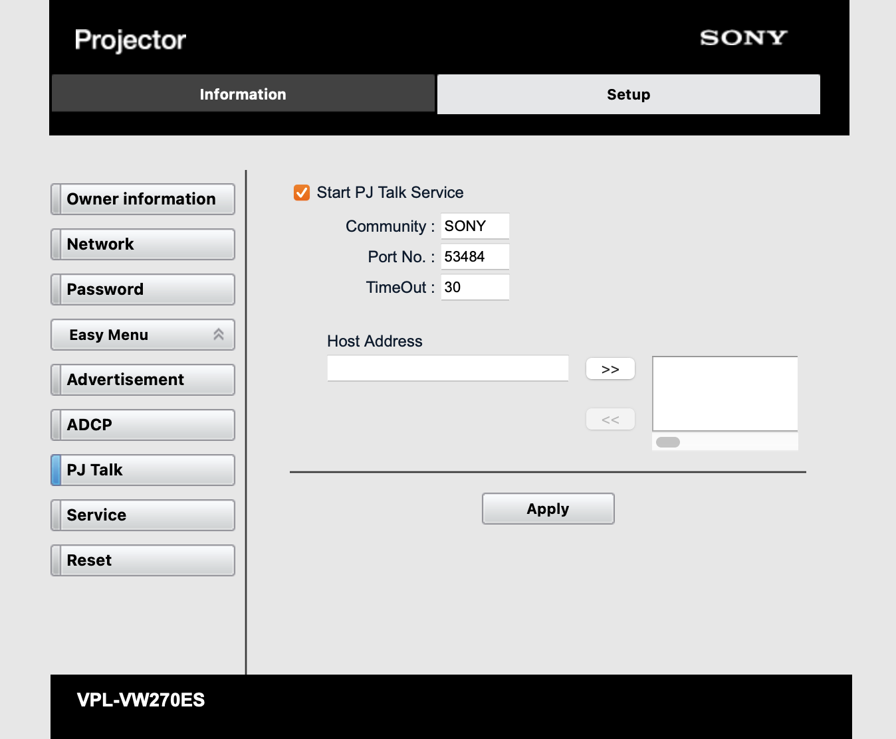

# Sony Projector Integration for Unfolded Circle Remote Two

## ⚠️ WARNING ⚠️

### Disclaimer: This software is at an early stage of development and may contain serious bugs that could affect system stability. Please use it at your own risk!

##

Integration for [Unfolded Circle Remote Two](https://unfoldedcircle.com) to control Sony projectors that support the SDCP/PJTalk protocol.

Using [uc-integration-api](https://github.com/aitatoi/integration-python-library)
and a modified and extended version of [pySDCP](https://github.com/Galala7/pySDCP) that is included in this repository.
<!--  #TODO If all commands from protocol.py have been implemented into pySDCP as separate commands create a upstream pull request and remove pySDCP files when it has been merged  -->

### Supported commands:

- Turn On/Off/Toggle
- Mute/Unmute/Toggle
    - Used for picture muting
- Cursor Up/Down/Left/Right/Enter
    - The back command is enabled but no command has been mapped as the projector has no such function. Back is always included when using the Dpad feature to use the cursor/enter commands.
- Home
    - Opens the setup menu. Used instead of the menu feature because of the hard mapped home button when opening the entity from a profile page
- Source Select
  - HDMI 1, HDMI 2
- Simple Commands
  - Calibration Presets*
    - Cinema Film 1, Cinema Film 2, Reference, TV, Photo, Game, Bright Cinema, Bright TV, User
  - Aspect Ratios*
    - Normal, Stretch**, V Stretch, Ratio Squeeze, Zoom 1:85, Zoom 2:35
  - Lens Control
    - Lens Shift Up/Down/Left/Right
    - Lens Focus Far/Near
    - Lens Zoom Large/Small

\* *Only works if a signal is present at the input* \
\** *May not work with all signal inputs*

### Supported attributes:

- State (On, Off, Unknown)
- Muted (True, False)
- Source
- Source List (HDMI 1, HDMI 2)

### Planned features:

- Add remaining commands from protocol.py
- Picture position and advanced iris commands (needs testers as i only own a VPL-VW-270 that doesn't support lens memory and iris control)
- Auto discovery of the projector (already supported by pySDCP)
- Additional sensor entity to show the lamp time

*Planned improvements are labeled with #TODO in the code*

### Known supported projectors

*According to pySDCP and/or personal testing.*

- VPL-HW65ES
- VPL-VW100
- VPL-VW260
- VPL-VW270
- VPL-VW285
- VPL-VW315
- VPL-VW320
- VPL-VW328
- VPL-VW365
- VPL-VW515
- VPL-VW520
- VPL-VW528
- VPL-VW665

*Please inform me if you have a projector that is not on this list and it works with pySDCP or this integration*

## Usage

### Setup

#### Activate SDCP/PJTalk

Open the projectors web interface and go to *Setup/Advanced Menu (left menu)/PJTalk*, activate the *Start PJ Talk Service* checkbox and click on *Apply*



#### Requirements

- UCR2 firmware 1.7.4 or newer to support simple commands
- Python 3.11
- Install Libraries:  
  (using a [virtual environment](https://docs.python.org/3/library/venv.html) is highly recommended)

```shell
pip3 install -r requirements.txt
```

### Run

```shell
python3 intg-sonysdcp/driver.py
```

### Run as a Docker container

For the mDNS adventisement to work correctly it's advised to start the integration in the host network (`--net=host`). You can also set the websocket listening port with the environment variable `UC_INTEGRATION_HTTP_PORT` or set the listening interface with `UC_INTEGRATION_INTERFACE`. See available [environment variables](https://github.com/unfoldedcircle/integration-python-library#environment-variables)
in the Python integration library.

All data is mounted to `/usr/src/app`:

```shell
docker run --net=host -v './localdir/ucr2-integration-sonySDCP':'/usr/src/app/':'rw' 'python:3.11' /usr/src/app/docker-entry.sh
```

## Build self-contained binary for Remote Two

*Note: Uploading custom integrations to the remote is not yet supported with the current firmware. The status can be tracked in this issue: [#79](https://github.com/unfoldedcircle/feature-and-bug-tracker/issues/79)*

Unfolded Circle recommends to create a single binary file that has everything in it as python on embedded systems is a nightmare.

To do that, we need to compile it on the target architecture as `pyinstaller` does not support cross compilation.

### x86-64 Linux

On x86-64 Linux we need Qemu to emulate the aarch64 target platform:

```bash
sudo apt install qemu binfmt-support qemu-user-static
docker run --rm --privileged multiarch/qemu-user-static --reset -p yes
```

Run pyinstaller:

```shell
docker run --rm --name builder \
    --platform=aarch64 \
    --user=$(id -u):$(id -g) \
    -v "$PWD":/workspace \
    docker.io/unfoldedcircle/r2-pyinstaller:3.11.6  \
    bash -c \
      "python -m pip install -r requirements.txt && \
      pyinstaller --clean --onefile --name intg-sonysdcp intg-sonysdcp/driver.py"
```

### aarch64 Linux / Mac

On an aarch64 host platform, the build image can be run directly (and much faster):

```shell
docker run --rm --name builder \
    --user=$(id -u):$(id -g) \
    -v "$PWD":/workspace \
    docker.io/unfoldedcircle/r2-pyinstaller:3.11.6  \
    bash -c \
      "python -m pip install -r requirements.txt && \
      pyinstaller --clean --onefile --name intg-sonysdcp intg-sonysdcp/driver.py"
```

## Versioning

I use [SemVer](http://semver.org/) for versioning. For the versions available, see the
[tags and releases in this repository](https://github.com/kennymc-c/ucr2-integration-sonySDCP/releases).

## Changelog

The major changes found in each new release are listed in the [changelog](CHANGELOG.md)
and under the GitHub [releases](/releases).

## Contributions

Contributions to add new feature, implement #TODOs from the code or improve the code quality and stability are welcome! Please fork this repository first and then create a pull request to merge your commits and explain what you want to change or add.

## License

This project is licensed under the [**GNU GENERAL PUBLIC LICENSE**](https://choosealicense.com/licenses/gpl-3.0/).
See the [LICENSE](LICENSE) file for details.
