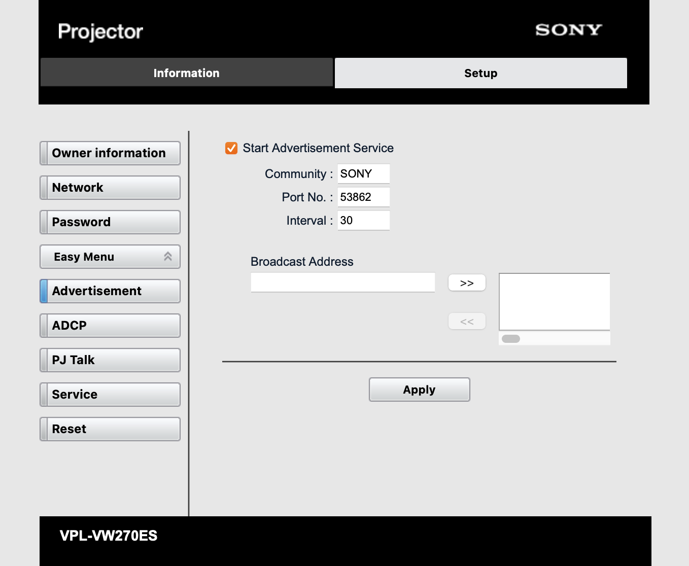

# Sony Projector integration for Unfolded Circle Remote Two and Remote 3 (Unfolded OS)

## ⚠️ WARNING ⚠️

### Disclaimer: This software may contain bugs that could affect system stability. Please use it at your own risk!

##

Integration for Unfolded Circle [Remote Two](https://www.unfoldedcircle.com/remote-two) and [Remote 3](https://www.unfoldedcircle.com) running [Unfolded OS](https://www.unfoldedcircle.com/unfolded-os) to control Sony projectors that support the SDCP/PJ Talk protocol.

Using [uc-integration-api](https://github.com/aitatoi/integration-python-library)
and a modified and extended version of [pySDCP](https://github.com/Galala7/pySDCP) that is included in this repository.

### Supported commands:

- Turn On/Off/Toggle
- Mute/Unmute/Toggle
  - Used for picture muting
- Cursor Up/Down/Left/Right/Enter
  - The back command is also mapped to cursor left as there is no separate back command for the projector. Inside the setup menu cursor left has the same function as a typical back command.
- Home
  - Opens the setup menu. Used instead of the menu feature because of the hard mapped home button when opening the entity from a profile page
- Source Select
  - HDMI 1, HDMI 2
- Simple Commands
  - Calibration Presets*
    - Cinema Film 1, Cinema Film 2, Reference, TV, Photo, Game, Bright Cinema, Bright TV, User
  - Aspect Ratios*
    - Normal, Stretch**, V Stretch, Ratio Squeeze, Zoom 1:85, Zoom 2:35
  - Motionfow*
    - Off, Smoth High, Smoth Low, Impulse\*\*\*, Combination\***, True Cinema
  - HDR*
    - On, Off, Auto
  - 2D/3D Display Select**
    - 2D, 3D, Auto
  - 3D Format**
    - Simulated 3D, Side-by-Side, Over-Under
  - Lamp Control*
    - High, Low
  - Input Lag Reduction*
    - On, Off
  - Menu Position
    - Bottom Left, Center
  - Lens Control
    - Lens Shift Up/Down/Left/Right
    - Lens Focus Far/Near
    - Lens Zoom Large/Small

\* _Only works if a video signal is present at the input_ \
\** _May not work work with all video signals. Please refer to Sony's user manual_ \
\*** _May not work on certain projector models that do not support this mode/feature. Please refer to Sony's user manual_

_If a command can't be processed or applied by the projector this will result in a bad request error on the remote. The response error message from the projector is shown in the integration log_

### Supported attributes:

- State (On, Off, Unknown)
- Muted (True, False)
- Source
- Source List (HDMI 1, HDMI 2)

By default the integration checks the status of all attributes every 20 seconds. The interval can be changed in config.py. Set it to 0 to deactivate this function.

### Planned features:

- Picture position and advanced iris commands (needs testers as I only own a VPL-VW-270 that doesn't support lens memory and iris control)
- Additional sensor entity to show the lamp time
- Additional remote entity to automatically map all commands to buttons and the ui grid
- Configure poller interval, SDCP & SDAP ports and PJTalk community in an advanced setup

*Planned improvements are labeled with #TODO in the code*

### Known supported projectors

*According to pySDCP and/or personal testing.*

- VPL-HW65ES
- VPL-VW100
- VPL-VW260
- VPL-VW270
- VPL-VW285
- VPL-VW315
- VPL-VW320
- VPL-VW328
- VPL-VW365
- VPL-VW515
- VPL-VW520
- VPL-VW528
- VPL-VW665

*Please inform me if you have a projector that is not on this list and it works with pySDCP or this integration*

## Usage

### Projector Setup

#### Activate SDCP/PJTalk

Open the projectors web interface and go to _Setup/Advanced Menu (left menu)/PJTalk_, activate the *Start PJ Talk Service* checkbox and click on _Apply_.


#### Optional: Change SDAP Interval

During the initial setup the integration tries to query data from the projector via the SDAP advertisement protocol to generate a unique entity id. The default SDAP interval is 30 seconds. You can shorten the interval to a minimum value of 10 seconds under _Setup/Advanced Menu/Advertisement/Interval_.



## Installation

### Run on the remote

_This requires firmware 1.9.0 or newer_

#### Download integration

Download the tar.gz archive in the assets section from the [latest release](https://github.com/kennymc-c/ucr2-integration-sonySDCP/releases/latest)

#### Install driver on the remote

The driver installation is currently only possible via the Core API and still in beta. The configuration file is not included in backups.

```shell
curl --location 'http://$IP/api/intg/install' \
--user 'web-configurator:$PIN' \
--form 'file=@"uc-intg-sonysdcp-$VERSION-aarch64.tar.gz"'
```

UC plans to integrate the upload function to the web configurator once they get enough positive feedback from developers (and users). The current status can be tracked in this issue: [#79](https://github.com/unfoldedcircle/feature-and-bug-tracker/issues/79)

### Run as an external integration on a separate server

#### Bare metal/VM

##### Requirements

- Firmware 1.7.4 or newer to support simple commands
- Python 3.11
- Install Libraries:  
  (using a [virtual environment](https://docs.python.org/3/library/venv.html) is highly recommended)

```shell
pip3 install -r requirements.txt
```

##### Start the integration

```shell
python3 intg-sonysdcp/driver.py
```

#### Docker container

For the mDNS advertisement to work correctly it's advised to start the integration in the host network (`--net=host`). You can also set the websocket listening port with the environment variable `UC_INTEGRATION_HTTP_PORT`, set the listening interface with `UC_INTEGRATION_INTERFACE` or change the default debug log level with `UC_LOG_LEVEL`. See available [environment variables](https://github.com/unfoldedcircle/integration-python-library#environment-variables)
in the Python integration library.

All data is mounted to `/usr/src/app`:

```shell
docker run --net=host -n 'ucr2-integration-sonysdcp' -v './ucr2-integration-sonySDCP':'/usr/src/app/':'rw' 'python:3.11' /usr/src/app/docker-entry.sh
```

## Build

Instead of downloading the integration driver archive from the release assets you can also build and create the needed distribution binary and tar.gz archive yourself.

For Python based integrations Unfolded Circle recommends to use `pyinstaller` to create a distribution binary that has everything in it, including the Python runtime and all required modules and native libraries.

### Build distribution binary

First we need to compile the driver on the target architecture because `pyinstaller` does not support cross compilation.

The `--onefile` option to create a one-file bundled executable should be avoided:
- Higher startup cost, since the wrapper binary must first extract the archive.
- Files are extracted to the /tmp directory on the device, which is an in-memory filesystem.  
  This will further reduce the available memory for the integration drivers!

We use the `--onedir` option instead.

#### x86-64 Linux

On x86-64 Linux we need Qemu to emulate the aarch64 target platform:

```bash
sudo apt install qemu binfmt-support qemu-user-static
docker run --rm --privileged multiarch/qemu-user-static --reset -p yes
```

Run pyinstaller:

```shell
docker run --rm --name builder \
    --platform=aarch64 \
    --user=$(id -u):$(id -g) \
    -v "$PWD":/workspace \
    docker.io/unfoldedcircle/r2-pyinstaller:3.11.6-0.2.0  \
    bash -c \
      "cd /workspace && \
      python -m pip install -r requirements.txt && \
      pyinstaller --clean --onedir --name driver intg-sonysdcp/driver.py"
```

#### aarch64 Linux / Mac

On an aarch64 host platform, the build image can be run directly (and much faster):

```shell
docker run --rm --name builder \
    --user=$(id -u):$(id -g) \
    -v "$PWD":/workspace \
    docker.io/unfoldedcircle/r2-pyinstaller:3.11.6-0.2.0  \
    bash -c \
      "cd /workspace && \
      python -m pip install -r requirements.txt && \
      pyinstaller --clean --onedir --name intg-sonysdcp intg-sonysdcp/driver.py"
```

### Create tar.gz archive

Now we need to create the tar.gz archive that can be installed on the remote and contains the driver.json metadata file and the driver distribution binary inside the bin directory

```shell
mkdir -p artifacts/bin
mv dist/intg-sonysdcp/* artifacts/bin
mv artifacts/bin/intg-sonysdcp artifacts/bin/driver
cp driver.json artifacts/
tar czvf uc-intg-sonysdcp-aarch64.tar.gz -C artifacts .
rm -r dist build artifacts intg-sonysdcp.spec
```

## Versioning

I use [SemVer](http://semver.org/) for versioning. For the versions available, see the
[tags and releases in this repository](https://github.com/kennymc-c/ucr2-integration-sonySDCP/releases).

## Changelog

The major changes found in each new release are listed in the [changelog](CHANGELOG.md)
and under the GitHub [releases](/releases).

## Contributions

Contributions to add new feature, implement #TODOs from the code or improve the code quality and stability are welcome! First check whether there are other branches in this repository that maybe already include your feature. If not, please fork this repository first and then create a pull request to merge your commits and explain what you want to change or add.

## License

This project is licensed under the [**GNU GENERAL PUBLIC LICENSE**](https://choosealicense.com/licenses/gpl-3.0/).
See the [LICENSE](LICENSE) file for details.
